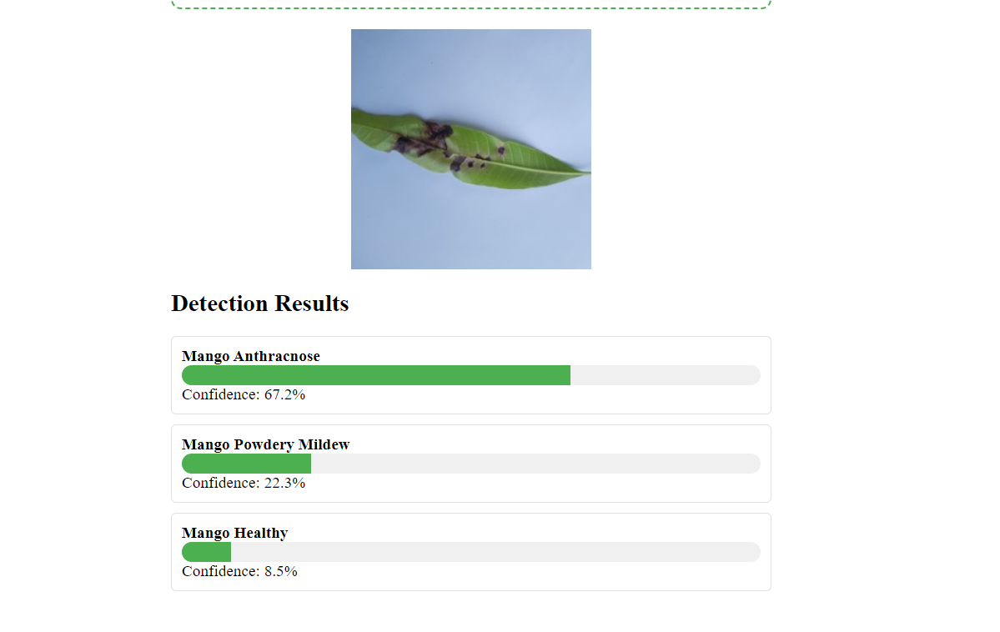
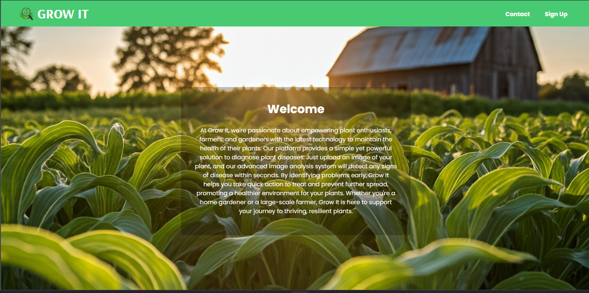
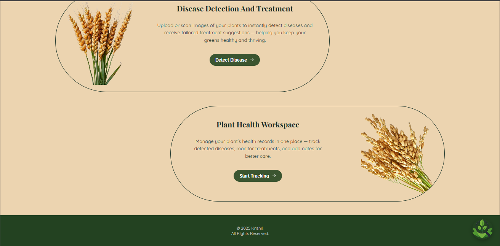
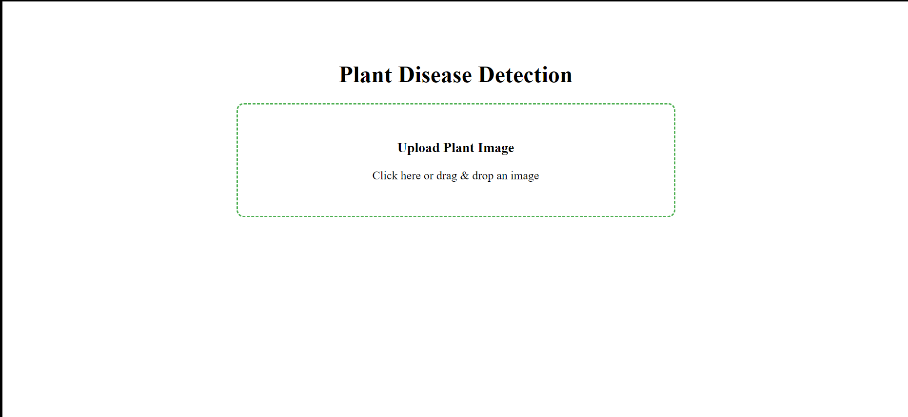

# Plant disease detection

The project is about detecting the disease that are very common among plants and to diagnose them before the eat the whole crop. This will help farmres in detecting the disease and getting its cure as soon as possible. 

## Working 

I have used a custom CNN algorithm to detect a plant disease from a pretrained database. In the above image the leave is of mango which is having disease Anthracnose. 

## Look and feel of the website

This is the front page with brief introduction for the website.

We can use functionalities like detect the disease, work in our own workspace and upload our own customized dataset. 

Here we can upload images of the leaves and detect the disease 

## Future enhancements 

The model is not that accurate as i am currently working on it. Still going throught the topics in deep learning.
I want to integrate a real time cure suggestion for farmers when they detect the disease. 
The work is also going on the website. 

Thank you. 